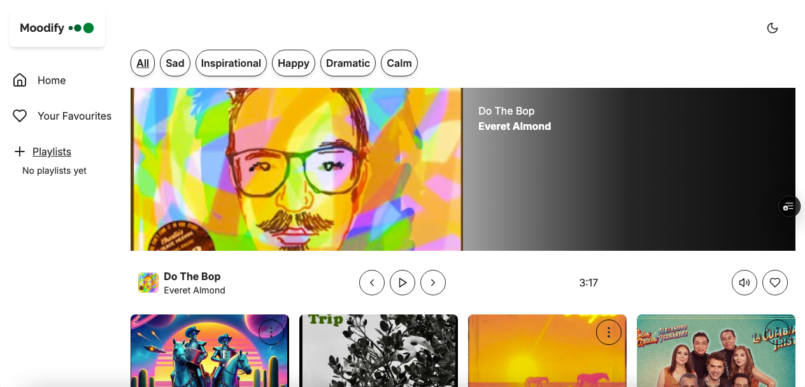

# Moodify - A Spotify-Inspired Music Player

Moodify is a custom-built music player application inspired by Spotify, designed to let users explore, play, and manage songs based on moods. Built from scratch, this project showcases a blend of modern web development tools and technologies, with a focus on learning and solidifying skills in TypeScript, Tailwind CSS, and React Context for state management. While I initially explored integrating Spotify’s API and authentication, I pivoted to a standalone app using mock data due to limitations with their free-tier restrictions.
This project was a journey of growth—learning to manipulate native audio controls with useRef, mastering responsive design with Tailwind CSS, and overcoming challenges like rethinking my initial desktop-first approach to prioritize mobile-first design.

---

### Features

- Mood-Based Playlists: Filter songs by mood categories (e.g., "Happy," "Chill").
- Favorites & Playlists: Add songs to favorites or custom playlists, stored in localStorage.
- Audio Playback: Play, pause, and control volume with a custom player using `useRef` for native audio manipulation.
- Responsive Design: Fully responsive layout optimized for mobile, tablet, and desktop.
- Dark/Light Mode: Toggle between themes, persisted in `localStorage`
- Toast Notifications: Feedback for actions like adding/removing songs.
- Toast Notifications: Feedback for actions like adding/removing songs.

### Technologies & Tools

- TypeScript: Used for type-safe coding, enhancing my TS skills throughout the project.

- React: Built with React for a component-based UI, leveraging hooks like `useState, useEffect, and useRef`.

- React Context: Centralized state management for songs, playback, and user preferences.

- Tailwind CSS: My first deep dive into utility-first CSS—used for styling and responsive design.

- LocalStorage: Persists favorites, playlists, and theme preferences across sessions.

- Vite: Fast development server and build tool for React.

- PNPM: Efficient package manager for installing dependencies.

- Prettier: Auto-formats code for consistency.

- ESLint: Enforces code quality and catches errors early.

- Husky: Pre-commit hooks to ensure code is formatted and linted before pushing to GitHub.

- Testing (Next Step): Planned integration with React Testing Library (RTL) for unit tests.

### Challenges & Lessons Learned

1.  Mobile-First Design Oversight:

    - Challenge: I initially focused on desktop implementation, neglecting mobile responsiveness. This led to a major redo of the layout.

    - Lesson: Start with a mobile-first approach to ensure scalability across devices from the beginning.

2.  Spotify API Integration:

    - Challenge: Spent significant time integrating Spotify’s API and authentication, only to hit roadblocks with free-tier restrictions (e.g., limited playback control).

    - Lesson: Thoroughly read API documentation and assess limitations before diving in. Pivoted to mock data instead.

3.  Tailwind CSS Learning Curve:

    - Challenge: New to Tailwind, I struggled with utility class composition initially.

    - Lesson: Embraced its power for rapid, responsive styling—now a core skill!

4.  Audio Control with `useRef`:

    - Challenge: Manipulating native `<audio>` elements was tricky without a library.

    - Lesson: Mastered `useRe` to control play, pause, and progress directly.

5.  TypeScript Solidification:

    - Challenge: Early TS errors slowed me down (e.g., type mismatches in Context).

    - Lesson: Gained confidence in defining interfaces and typing complex state.

---

## Installation & Setup

This project uses Vite for development and PNPM for package management. Follow these steps to run it locally.

### Prerequisites

- Node.js: v16 or higher

- PNPM: Install globally with `npm install -g pnp`

### Local Development

1.  Clone the Reposiory:

```bash
git clone https://github.com/mesfint/moodify.git
cd moodify
```

2.  Install Dependencies:

```bash
pnpm install
```

3.  Run the App:

```bash
pnpm run  dev

```

- Opens at http://localhost:5173 (default Vite port).

### Demo

[Moodify](https://moodify-drab.vercel.app/)


